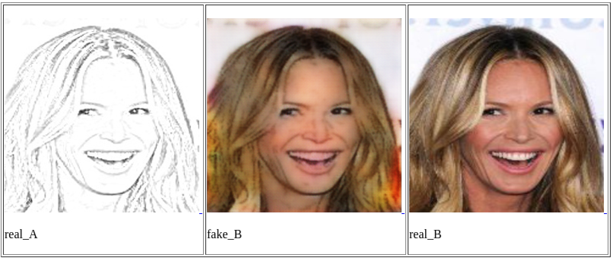

## Synopsis

The goal of this project is to use Machine Learning to transform police sketches to realistic images.

## Motivation

The overall motivation is to help the police better identify and catch the bad guys faster.

## Requirements
* [imagemagick](https://imagemagick.org/script/index.php)

## Creating Datasets (!Deprecated)
1. Create a folder in `sketch2pix/dataset`
	*	ie. `faces-edge1`
2. Within that folder create 3 folders `edge`, `face`, `face2edge`
3. Within each of those 3 folders create 2 folders `test`, `train`
4. Put your output images in the `face` folder and split them however you want into the `test` and `train` folders. It's recommended you train on 70% of your images and test the other 30%
5. Use the `sketch.sh` script to generate the edge versions (aka inputs) of your `face` images
	* in the `sketch2pix/dataset` run

	```bash
	./sketch.sh --image-path /path/to/image_folder --face-path /path/to/face_folder  --sketch-path /path/to/sketch_folder
	```

	* --sketch-path should be the `train` or `test` folder in `edge`

6. Use the `combine.sh` script to generate the combination images needed for `pix2pix` to train and test
	* in the `sketch2pix/dataset` run

	```bash
	./combine.sh --path faces-edge1
	```

	* **This command will output to the `face2edge` folder**

## Creating Dataset

Run 

```
> python sketch2pix/dataset/PencilSketch/gen_sketch_and_gen_resized_face.py \
/path/to/image_folder /path/to/face_folder /path/to/sketch_folder
```

## Training a Model
In `sketch2pix`

Run

```bash
./train.sh --data-root ../dataset/celebfaces/face2edge --name edge2face_generation --direction BtoA --torch /root/torch/install/bin/th
```
Required parameters:

`--data-root`: the `face2edge` folder of your dataset

`--name` : name of experiment

`--direction` : `BtoA` or `AtoB`

`--torch` : path to `th` bin

As the model trains checkpoints will be stored in:

```
sketch2pix/pix2pix/checkpoints/{--name}
```
where `--name` is the value passed into the scripts from above.


[More info here](https://github.com/phillipi/pix2pix#train)


## Testing a Model
In `sketch2pix`

Run

```bash
./test.sh --data-root ../dataset/celebfaces/face2edge --name edge2face_generation --direction BtoA --torch /root/torch/install/bin/th [--custom_image_dir my_named_gen]
```

Required parameters:

`--data-root`: the `face2edge` folder of your dataset

`--name` : should be the same as what was used in the train script

`--direction` : `BtoA` or `AtoB`

`--torch` : path to `th` bin

Optional parameters:

`--custom_image_dir` : name of the directory you want results outputted to. Default uses the model name if not supplied.

[More info here](https://github.com/phillipi/pix2pix#test)


## Validating your models
After testing your results are stored in

```
sketch2pix/pix2pix/results/{--name}/latest_net_G_test/index.html
```
where `--name` is the value passed into the scripts from above.

Open that html file in a browser to examine the results of your test.



## TODO
On how to improve it
* Realistic sketch generation that matches pencil sketches [done]
* More training data [done]
* Using a face segmenter, seperating the face out of the background, so input photo is just a face on white background. This way, the generated photos will also have a white background and the sketches will not have the background either.
* Using seperate model for men and women, seperate model for different hair colours. All achievable by running through internal FaceSDK

## Open Datasets
* [Large-scale CelebFaces Attributes](http://mmlab.ie.cuhk.edu.hk/projects/CelebA.html)
* [Labeled Faces In The Wild](http://vis-www.cs.umass.edu/lfw/#download)
* [CUHK Face Sketch Database](http://mmlab.ie.cuhk.edu.hk/archive/facesketch.html)
* [CUHK Face Sketch FERET Database](http://mmlab.ie.cuhk.edu.hk/archive/cufsf/index.html#Downloads)
* [XM2VTS data set](http://www.ee.surrey.ac.uk/CVSSP/xm2vtsdb/)
* [SCface - Surveillance Cameras Face Database](http://www.scface.org/)
* [Face Recognition Databases](http://www.face-rec.org/databases/)
* [adiencedb](http://www.cslab.openu.ac.il/personal/Hassner/adiencedb/) - [homepage](http://www.openu.ac.il/home/hassner/Adience/data.html)

## Acknowledgements

* [pix2pix](https://github.com/phillipi/pix2pix)
* [rakshitw/Sketch](https://github.com/rakshitw/Sketch)

## Contributors

* **[User1m](https://github.com/user1m)** - *Script development and Pix2Pix model training / testing, [Web App](http://sketchme.azurewebsites.net/)*
* **[koul](https://github.com/koul)** - *Seed idea*
* **[wtam](https://github.com/wtam)**, **[tikyau](https://github.com/tikyau)**, **[getCloudy](https://github.com/getCloudy)** - *Help with data generation*

## License

MIT
